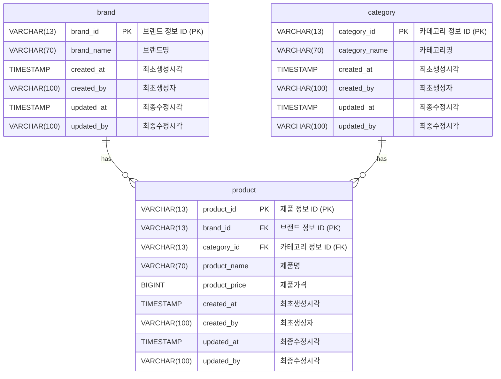

# 김영근 - 무신사 백엔드 과제전형

## 주어진 과제 범위 및 완성 여부

### 필수 구현 범위

| 구현기능                                                               | 완성  | 비고|
|:-------------------------------------------------------------------|:---:|:--------------------------------------------------------------------------------------------------------------------------------------------------------------------------------------------------------------------------------------------------------------------|
| 카테고리 별 최저가격 브랜드와 상품 가격, 총액을 조회하는 API                               |  O  | [가격 관련 API 명세서](http://localhost:8080/swagger-ui/index.html?urls.primaryName=%EA%B0%80%EA%B2%A9%EC%A0%95%EB%B3%B4+API)|
| 단일 브랜드로 모든 카테고리 상품을 구매할 때 최저가격에 판매하는 브랜드와 카테고리의 상품가격, 총액을 조회하는 API |  O  | [가격 관련 API 명세서](http://localhost:8080/swagger-ui/index.html?urls.primaryName=%EA%B0%80%EA%B2%A9%EC%A0%95%EB%B3%B4+API)|
| 카테고리 이름으로 최저, 최고 가격 브랜드와 상품 가격을 조회하는 API                           |  O  | [가격 관련 API 명세서](http://localhost:8080/swagger-ui/index.html?urls.primaryName=%EA%B0%80%EA%B2%A9%EC%A0%95%EB%B3%B4+API)|
| 브랜드 및 상품을 추가 / 업데이트 / 삭제하는 API                                     |  O  | [브랜드 정보 관련 API 명세서](http://localhost:8080/swagger-ui/index.html?urls.primaryName=%EB%B8%8C%EB%9E%9C%EB%93%9C+%EC%A0%95%EB%B3%B4+API) <br/> [제품 정보 관련 API 명세서](http://localhost:8080/swagger-ui/index.html?urls.primaryName=%EC%A0%9C%ED%92%88+%EC%A0%95%EB%B3%B4+API)|

### 구현 완료시 가산점 부여가 가능한 범위

| 구현기능                            | 완성 | 비고                                                                                   |
|:--------------------------------|:--:|:-------------------------------------------------------------------------------------|
| Unit test 및 Integration test 작성 | O  | 유닛테스트와 통합테스트를 구분하여 작성하진 않았습니다.<br/> 다만, api 엔드포인트의 테스트코드가 실질적인 통합테스트 코드 역할을 맡고 있습니다. |
| Frontend 페이지 구현                 | X  | 남은 시간이 촉박하여 이 범위까진 구현하지 못하였습니다.                                                      |

## 과제 구현시 사용한 기술

- JVM 버전 : **21**
- 프로그래밍 언어 : **코틀린(v2.1.10)**
- 데이터베이스 : **H2, Redis**
  - 서버 작동에 필요한 중요한 데이터는 H2에 적재하엿으며, Redis는 분산락 기능을 구현하기 위해 사용하였습니다.
- 웹 프레임워크 : **스프링 부트 (v3.4.2, WebMvc)**
  - **가상스레드 활성화 여부 : true**
- 데이터베이스 영속성 관리
  - 기본적으로 **spring-data-jpa** 를 활용하였으나, 다음과 같은 것들도 함께 사용했습니다.
    - **kotlin-jdsl (v.3.5.4)** : JPQL을 보다 쉽게 작성하기 위해 사용했습니다.
    - JdbcTemplate : JPQL로는 구현하기 어려운 데이터 조회 기능을 네이티브 SQL을 작성하는 방향으로 해결하기 위해 사용했습니다.
- 유닛테스트 라이브러리
  - **junit5** : 유닛테스트 코드 작성시 사용한 라이브러리입니다.
  - **TestContainer** : 유닛테스트 코드 수행시 필요한 각종 인스턴스를 띄우기 위해 활용하였습니다.이번 과제에서는 분산락 구현을 위한 레디스 인스턴스를 띄우기 위해 사용했습니다.
- API 문서화 툴
  - **Swagger (v3.x)** : API 문서화 및 간단한 API 테스트 기능을 제공하기 위해 사용했습니다.
- 컨테이너 기반의 인프라 환경 : Docker 및 Docker Compose를 활용햇습니다.

## 실행방법

※ 윈도우 환경에서는 WSL을 활용하시는 것을 권장드립니다.

1. 루트 디렉토리에서 아래와 같은 Gradle 명령어를 통해, jar 파일을 빌드합니다. 이때 유닛테스트 코드도 함께 작동합니다.
   ```shell
   ./gradlew clean build
   ```
2. Gradle 빌드가 완료되면, 루트 디렉토리에서 아래와 같은 명령어를 활용해 컨테이너 이미지를 빌드합니다.
   ```shell
   docker build -t musinsa-server .
    ```    
3. Gradle 빌드가 완료되면, `docker-compose` 명령어를 통해 백엔드 서버를 작동시킬 수 있습니다.
  - 이때, 분산 트랜잭션 기능을 위해 레디스도 함께 작동시킵니다.
   ```shell
   docker-compose up -d
   ```
4. 백엔드 서버가 정상적으로 작동했는지 확인합니다.

- http://localhost:8080/actuator/health 에 접근시, 아래와 같은 응답을 받았다면 정상 작동 중입니다.

   ```json
   {
  "status": "UP"
}
   ```

## API 문서 확인 및 API 작동 테스트 방법

[실행방법](#실행방법) 항목을 통해 안내드린 대로 서버 작동에 성공하하셨다면, 스웨거를 통해 API 명세 확인 및 테스트가 가능합니다.

- [스웨거 메인화면](http://localhost:8080/swagger-ui/index.html)
  - [브랜드 정보 조회 / 수정 / 삭제 API 명세서](http://localhost:8080/swagger-ui/index.html?urls.primaryName=%EB%B8%8C%EB%9E%9C%EB%93%9C+%EC%A0%95%EB%B3%B4+API)
  - [제품 정보 조회 / 수정 / 삭제 API 명세서](http://localhost:8080/swagger-ui/index.html?urls.primaryName=%EC%A0%9C%ED%92%88+%EC%A0%95%EB%B3%B4+API)
  - [가격 관련 (카테고리별 최저가 브랜드 등) API 명세서](http://localhost:8080/swagger-ui/index.html?urls.primaryName=%EA%B0%80%EA%B2%A9%EC%A0%95%EB%B3%B4+API)

## 데이터베이스 설계 구조

- 이번 과제를 수행하며 설계한 데이터베이스 설계는 다음과 같습니다.


